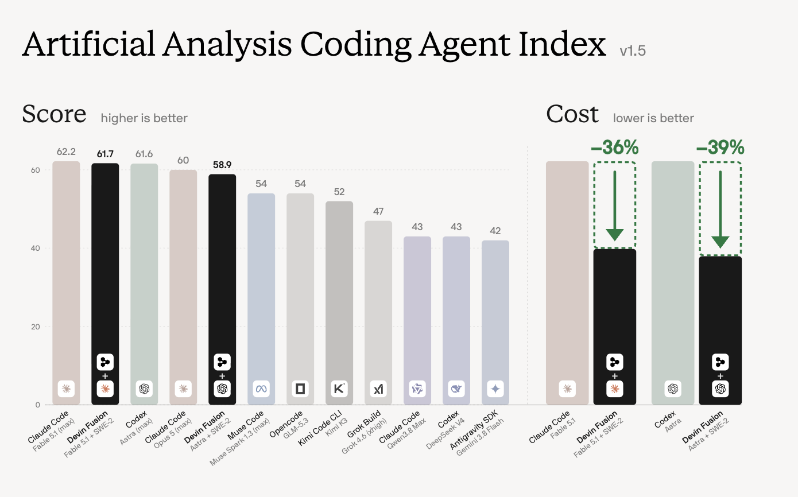
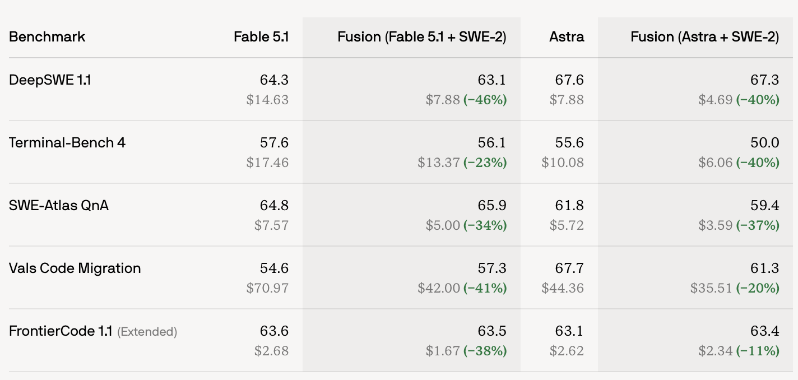

# OpenFusion

**The goal: frontier-quality coding agents at 23–46% lower cost, paid for with the subscriptions you already have.**

Cognition's [Devin Fusion](https://cognition.com/blog/devin-fusion) pairs a frontier **lead** that only plans, briefs, and reviews with a cheap **sidekick** that does the typing. On the Artificial Analysis Coding Agent Index, that pairing holds the frontier model's score and cuts cost by more than a third:



| Agent | Score (higher is better) | Cost (lower is better) |
|---|---|---|
| Claude Code, Fable 5.1 (max) | 62.2 | baseline |
| **Devin Fusion, Fable 5.1 + SWE-2** | **61.7** | **−36%** |
| Codex, Astra (max) | 61.6 | baseline |
| **Devin Fusion, Astra + SWE-2** | **58.9** | **−39%** |

Per benchmark the saving is 11–46%, with scores within a few points of the frontier model alone and sometimes above it:



| Benchmark | Fable 5.1 | Fusion (Fable 5.1 + SWE-2) | Astra | Fusion (Astra + SWE-2) |
|---|---|---|---|---|
| DeepSWE 1.1 | 64.3 · $14.63 | 63.1 · $7.88 (−46%) | 67.6 · $7.88 | 67.3 · $4.69 (−40%) |
| Terminal-Bench 4 | 57.6 · $17.46 | 56.1 · $13.37 (−23%) | 55.6 · $10.08 | 50.0 · $6.06 (−40%) |
| SWE-Atlas QnA | 64.8 · $7.57 | 65.9 · $5.00 (−34%) | 61.8 · $5.72 | 59.4 · $3.59 (−37%) |
| Vals Code Migration | 54.6 · $70.97 | 57.3 · $42.00 (−41%) | 67.7 · $44.36 | 61.3 · $35.51 (−20%) |
| FrontierCode 1.1 (Extended) | 63.6 · $2.68 | 63.5 · $1.67 (−38%) | 63.1 · $2.62 | 63.4 · $2.34 (−11%) |

*Source: Cognition's Devin Fusion announcement. The insight: the smart model should be the planner, not the typist, and the two should exchange briefs and results, not whole conversations.*

Devin Fusion is a closed product built on Cognition's own models. **OpenFusion is the same idea on the agents you already have.** It runs the unmodified `claude`, `codex`, `pi`, and `grok` CLIs you are logged into, assigns each a role, and gives the lead one extra tool: `fusion-delegate "<brief>"`. Every role is a `harness:model` you choose:

- **Lead**: the frontier model you already pay for, such as Claude Opus or Fable on your Claude plan. It plans, writes briefs, verifies, and reports.
- **Sidekick**: a cheap, fast model that does the typing: GPT-5.6 Luna on your ChatGPT plan, Haiku on your Claude plan, or GLM / Grok / Kimi / DeepSeek through your own OpenRouter key.
- **Reviewer**: a fresh-context model, ideally from the other vendor, that approves the diff before you see "done".
- **CUA** (optional): a computer-use agent that runs end-to-end tests.

No new API bill for the lead, no new harness to learn, one command:

```bash
uv tool install git+https://github.com/andrewsiah/openfusion   # or pipx / npm / brew, see below
fusion doctor                                                   # are your harnesses installed + logged in?
fusion "add rate limiting to /api/upload with tests"           # run a task in the current repo
```

`v0.1.0` · working prototype · MIT · Python ≥ 3.11, zero dependencies · issues and PRs welcome

---

## Table of contents

- [Quickstart](#quickstart)
- [Let your coding agent install it](#let-your-coding-agent-install-it)
- [Roles](#roles)
- [Install](#install)
- [Verify the setup](#verify-the-setup)
- [Run a task](#run-a-task)
- [Choose your models](#choose-your-models)
- [The CUA role (computer-use agent)](#the-cua-role-computer-use-agent)
- [How it works](#how-it-works)
- [CLI reference](#cli-reference)
- [Subscription usage and terms](#subscription-usage-and-terms)
- [Troubleshooting](#troubleshooting)
- [Contributing](#contributing)

---

## Quickstart

You need one harness logged in for the lead and one for the sidekick. In v0.1 the lead is spawned through Claude Code (`claude:opus` or `claude:fable`); other lead harnesses are on the roadmap, and every other role can be any harness today. The defaults below assume a Claude plan plus a ChatGPT plan.

```bash
# 1. Install fusion (pick one)
uv tool install git+https://github.com/andrewsiah/openfusion
# pipx install git+https://github.com/andrewsiah/openfusion
# npm install -g github:andrewsiah/openfusion
# brew tap andrewsiah/tap && brew install andrewsiah/tap/openfusion

# 2. Make sure the harnesses you want are installed and logged in
npm i -g @anthropic-ai/claude-code && claude        # sign in with your Claude plan, then exit
npm i -g @openai/codex && codex login               # sign in with your ChatGPT plan

# 3. Check everything talks
fusion doctor

# 4. Prove the loop on a throwaway repo (~1 min, a few cents)
fusion smoke

# 5. Run a real task from inside your repo
cd your-project
fusion "Make slugify() handle unicode and collapse repeated hyphens; add tests" --test-cmd "python3 -m unittest -q"
```

Changes land **uncommitted** in your working tree. Add `.fusion/` to your `.gitignore`.

Only have a Claude plan? Use `--exec claude:haiku --review claude:opus`. Have an OpenRouter key instead of ChatGPT? Use `--exec pi:z-ai/glm-5.3@openrouter`. See [Choose your models](#choose-your-models).

## Let your coding agent install it

Already in Claude Code, Codex, Cursor, or another agent? Paste this and let it do the setup. It follows the same steps as the manual install below, checks in with you before installing anything global, and never touches your logins.

````text
Install and set up OpenFusion (the `fusion` CLI) on this machine by following
https://raw.githubusercontent.com/andrewsiah/openfusion/main/skills/install-openfusion/SKILL.md

If you cannot fetch URLs, do this instead:
1. Check `python3 --version` is >= 3.11 (else find python3.12/3.11 on PATH; stop if none).
2. Install with the first available: `uv tool install git+https://github.com/andrewsiah/openfusion`,
   or `pipx install git+https://github.com/andrewsiah/openfusion`,
   or `npm install -g github:andrewsiah/openfusion`,
   or `brew tap andrewsiah/tap && brew install andrewsiah/tap/openfusion`.
   Verify `fusion --version` prints `fusion 0.1.0` before continuing.
3. Run `command -v claude codex pi grok`. In v0.1 the lead runs through Claude Code, so `claude`
   is needed; sidekick, reviewer, and cua can be any harness.
   Tell me which harnesses are missing and ASK before installing any:
   claude -> `npm i -g @anthropic-ai/claude-code` (I sign in by running `claude`)
   codex  -> `npm i -g @openai/codex` (I sign in with `codex login`)
   pi     -> `npm i -g @mariozechner/pi-coding-agent` (needs OPENROUTER_API_KEY in env or ./.env)
   Never run login flows yourself; they need my browser. Never read or move my credentials.
4. Run `fusion doctor` and explain any FAIL rows for harnesses I actually use.
5. If my setup is not "Claude lead + Codex sidekick + Codex reviewer", write
   ~/.config/fusion/config.toml with a [defaults] table: lead/exec/review as harness:model[@provider].
   Claude-only: exec="claude:haiku", review="claude:opus".
   OpenRouter sidekick: exec="pi:z-ai/glm-5.3@openrouter".
6. Add `.fusion/` to this repo's .gitignore.
7. ASK before running `fusion smoke` (it spends ~1 min and a few cents). Report the result.
8. Summarize: install path, version, which harnesses pass doctor, config written, and the
   command to run next: fusion "<task>" --test-cmd "<my test command>"
````

Prefer to install it as a reusable skill? Copy [skills/install-openfusion/SKILL.md](skills/install-openfusion/SKILL.md) into your agent's skills directory (for example `~/.claude/skills/install-openfusion/SKILL.md` for Claude Code, or `~/.agents/skills/install-openfusion/SKILL.md` for Codex) and ask the agent to "install openfusion".

## Roles

Every role is `harness:model[@provider]`, set per run with a flag or once in a config file.

| Role | What it does | Default | Alternatives |
|---|---|---|---|
| **lead** | plans, writes briefs, verifies with your test command and `git diff`, reports `DONE:` | `claude:opus` | `claude:fable` (v0.1 spawns the lead through Claude Code; other harnesses next) |
| **sidekick** | edits files, runs tests, reports back; one persistent session, resumed per brief | `codex:gpt-5.6-luna` | `claude:haiku`, `pi:z-ai/glm-5.3@openrouter`, `grok:grok-4.6` |
| **reviewer** | fresh context, read-only, strict-JSON verdict; one feedback round by default | `codex:gpt-5.6-terra` | `claude:opus`, `none` |
| **cua** (optional) | computer-use agent: runs e2e tests and drives browsers/CLIs; never edits source | none | `codex:gpt-5.6-terra`, `claude:sonnet` |

Research notes live in [docs/research/](docs/research/) and the design rationale in [PLAN.md](PLAN.md).

## Install

### 1. The `fusion` CLI

Pick whichever package manager you already use. All paths need only **Python ≥ 3.11**; the package itself has zero dependencies. Each installs three commands on PATH: `fusion`, `fusion-delegate`, `fusion-cua`.

| Method | Command | Notes |
|---|---|---|
| **uv** (recommended) | `uv tool install git+https://github.com/andrewsiah/openfusion` | `uv tool update-shell` if `fusion` is not found |
| **pipx** | `pipx install git+https://github.com/andrewsiah/openfusion` | `pipx ensurepath` if needed |
| **npm** | `npm install -g github:andrewsiah/openfusion` | you already have Node for `claude`/`codex`; wraps the bundled Python source and uses the first Python ≥ 3.11 it finds. Override with `FUSION_PYTHON=/path/to/python` |
| **Homebrew** | `brew tap andrewsiah/tap && brew install andrewsiah/tap/openfusion` | `--HEAD` for main |
| **pip** | `pip install --user git+https://github.com/andrewsiah/openfusion` | |
| **from source** | `git clone https://github.com/andrewsiah/openfusion && cd openfusion && uv tool install .` | |

Verify:

```bash
fusion --version   # fusion 0.1.0
```

PyPI and npm-registry releases (`uv tool install openfusion`, `npm i -g openfusion`) are coming. Until then, use the git URLs above.

### 2. The harnesses

Install and log in to the CLIs for the roles you want. Any role can use any harness; in v0.1 the lead is spawned through Claude Code, so install `claude` for it. The rest depends on what you pay for.

| Harness | Install | Log in / key | Roles |
|---|---|---|---|
| **Claude Code** | `npm i -g @anthropic-ai/claude-code` | run `claude` once and sign in with your Claude plan | lead (`claude:opus`, `claude:fable`), sidekick (`claude:haiku`), cua (`claude:sonnet` + `--chrome`), reviewer |
| **Codex CLI** | `npm i -g @openai/codex` | `codex login` with your ChatGPT plan | sidekick (`codex:gpt-5.6-luna`), cua and reviewer (`codex:gpt-5.6-terra`) |
| **Pi** | `npm i -g @mariozechner/pi-coding-agent` | `export OPENROUTER_API_KEY=sk-or-…` or put it in `./.env` | any BYOK model: `pi:z-ai/glm-5.3@openrouter`, `pi:x-ai/grok-4.6@openrouter`, `pi:grok-4.6@xai` … |
| **Grok Build CLI** | xAI's `grok` | grok.com login | sidekick (`grok:grok-4.6`) |

Which combination do you have?

| You pay for | Install | Run with |
|---|---|---|
| Claude + ChatGPT | `claude`, `codex` | defaults, nothing to configure |
| Claude only | `claude` | `--exec claude:haiku --review claude:opus` |
| Claude + OpenRouter key | `claude`, `pi` | `--exec pi:z-ai/glm-5.3@openrouter --review claude:opus` |
| All three | `claude`, `codex`, `pi` | mix freely, e.g. `--exec pi:z-ai/glm-5.3@openrouter --review codex:gpt-5.6-terra` |

## Verify the setup

**Doctor** sends one tiny prompt through each installed harness and shows PASS / FAIL / SKIP with cost. SKIP means not installed or no key, which is fine for harnesses you do not use.

```bash
fusion doctor
```

```
check                          status time    detail
claude:haiku                   PASS   7.6s    result='OK' cost=$0.0269
codex:gpt-5.6-luna             PASS   7.0s    result='OK' in=22266 cached=9984
grok:grok-4.6                  FAIL   1.0s    402 Payment Required: Grok Build usage balance exhausted
pi:z-ai/glm-5.3@openrouter     PASS   1.8s    result='OK' cost=$0.0003
```

**Smoke** runs the whole loop on a throwaway repo with a failing test. The lead must fix it *through* the sidekick and the reviewer must approve. About a minute, a few cents.

```bash
fusion smoke                                    # default roles
fusion smoke --exec pi:z-ai/glm-5.3@openrouter  # GLM as the sidekick
fusion smoke --review none --no-doctor          # skip reviewer and the doctor pre-check
```

Pass criteria: tests green, lead delegated at least once, lead made zero edits itself, lead said `DONE`, only the target file changed, reviewer approved.

## Run a task

From inside your repo:

```bash
fusion "Make slugify() handle unicode and collapse repeated hyphens; add unittest cases" --test-cmd "python3 -m unittest -q"
```

What you see:

```
fusion run 20260914-190040-3c3241  lead=claude:opus  sidekick=pi:z-ai/glm-5.3@openrouter  reviewer=codex:gpt-5.6-terra
lead: Verified: diff is confined to ... DONE: Fixed add() in calc.py ...
review: approve — calc.py correctly changes add() to return a + b ...
status: done   wall: 39.0s
role       spec                                  time  detail
lead       claude:opus                          19.5s  turns=6 delegations=1 edits=0 cost=$0.1975
sidekick   pi:z-ai/glm-5.3@openrouter            3.5s  briefs=1 cost=$0.0032
review 1   codex:gpt-5.6-terra                  19.5s  approve: ...
```

- The lead never edits files itself (`edits=0`). It briefs the sidekick, verifies with your `--test-cmd` and `git diff`, and reports `DONE:`.
- The reviewer checks the diff with fresh context. If it requests changes, the feedback goes back to the lead's live session for one more round (`--max-review-rounds`).
- Changes land **uncommitted** in your working tree for you to inspect and commit.
- Reports are saved to `.fusion/runs/<id>.json`. `fusion runs` lists them. Add `.fusion/` to `.gitignore`.

Other things you can do:

```bash
fusion review "the task I asked for"        # fresh-context review of your current uncommitted diff, no lead
fusion "…" --solo                          # baseline: the lead does everything itself, for cost comparison
fusion "…" --budget 2.00                   # cap the lead's spend in USD
fusion "…" --cua codex:gpt-5.6-terra       # add a computer-use agent for e2e tests
```

## Choose your models

Every role is `harness:model[@provider]`. Set them per run with flags:

```bash
fusion "…" --lead claude:opus  --exec codex:gpt-5.6-luna          --review codex:gpt-5.6-terra   # Claude + ChatGPT plans (default)
fusion "…" --lead claude:opus  --exec claude:haiku                --review claude:opus           # Claude plan only
fusion "…" --lead claude:fable --exec pi:z-ai/glm-5.3@openrouter  --review codex:gpt-5.6-terra   # OpenRouter sidekick
fusion "…" --lead claude:opus  --exec pi:x-ai/grok-4.6@openrouter --review none                   # no reviewer
fusion "…" --solo                                                                                 # baseline: Opus does everything itself
```

Or set defaults once in `~/.config/fusion/config.toml` (override the path with `FUSION_CONFIG`):

```toml
[defaults]
lead = "claude:opus"
exec = "pi:z-ai/glm-5.3@openrouter"
review = "codex:gpt-5.6-terra"
# cua = "codex:gpt-5.6-terra"
# test_cmd = "uv run pytest -q"
```

Or with env vars `FUSION_LEAD`, `FUSION_EXEC`, `FUSION_REVIEW`, `FUSION_CUA`, `FUSION_TEST_CMD`.

**Precedence:** flags > `FUSION_*` env > config file > built-ins.

## The CUA role (computer-use agent)

Coding models and computer-use models sit on different cost/capability curves, so the **CUA** is its own role with its own spec. It runs the end-to-end tests and any other computer-use task the lead needs: reproduce a bug in the browser, exercise a workflow, check a live page.

When set, the lead gets a second tool, `fusion-cua "<brief>"`, and is told to e2e-test through it before reporting DONE: run the CLI or app as a user would, hit endpoints, click through the UI if the harness has browser tools, and report PASS/FAIL per scenario with evidence. The CUA never edits source; the lead turns its FAIL findings into new sidekick briefs.

```bash
fusion "add a --json flag to the CLI" --cua codex:gpt-5.6-terra --test-cmd "python3 -m unittest -q"
FUSION_CUA_ARGS="--chrome" fusion "fix the signup form validation" --cua claude:sonnet   # Claude in Chrome
```

Pick a harness with the tools your app needs: Codex has browser/computer-use built in; Claude Code can drive Chrome (`FUSION_CUA_ARGS="--chrome"`) or a Playwright MCP server; Pi/OpenRouter models suit CLI and HTTP flows. `FUSION_EXEC_ARGS` does the same for the sidekick. The CUA keeps its own persistent session and shows up as its own row in the report. Config key: `cua`; env: `FUSION_CUA`.

## How it works

```
fusion "task"
  ├─ Lead      claude:opus            one persistent Claude Code session, plus a role prompt and the
  │                                   fusion-delegate tool. Plans, briefs, verifies, reports DONE.
  ├─ Sidekick  codex / pi / claude    one persistent session, resumed per brief (its prompt cache stays warm).
  │                                   Edits files, runs tests, reports back.
  ├─ CUA       codex / claude / pi    optional computer-use agent; e2e tests + other computer-use tasks via fusion-cua, own session, never edits.
  ├─ Reviewer  codex / claude         fresh context, read-only, strict-JSON verdict; 1 feedback round by default.
  └─ Report    .fusion/runs/<id>.json wall-clock, per-role turns/tokens/cost, lead edit count.
```

Design choices, all from Cognition's write-ups and our first runs:

- The lead is hands-off **by instruction**, not by tool surgery. Frontier models follow the role prompt; `--strict` removes Edit/Write if yours does not.
- One sidekick writes at a time. Parallel writer swarms do not work.
- Reviewers get fresh context, ideally from the other vendor.
- Measure cost per task, not per token. A pricier sidekick that needs fewer turns can be cheaper.
- The lead runs in Claude Code's safe mode by default, so your personal `CLAUDE.md`, hooks, and skills do not leak into the role. `--no-safe-mode` turns that off.

Full rationale in [PLAN.md](PLAN.md).

## CLI reference

### Commands

| Command | What it does |
|---|---|
| `fusion "<task>" [flags]` | run a task in the current repo (same as `fusion run "<task>"`) |
| `fusion doctor` | check that each harness is installed, logged in, or keyed. `--pi-model`, `--pi-provider` to change the Pi probe |
| `fusion smoke [role flags] [--no-doctor]` | end-to-end check on a throwaway repo |
| `fusion review "<task>" [--review SPEC] [--test-cmd CMD]` | fresh-context review of your current uncommitted diff |
| `fusion runs` | list past runs from `./.fusion/runs` |
| `fusion --version` | print the version |

### `fusion run` flags

| Flag | Default | Meaning |
|---|---|---|
| `--lead SPEC` | `claude:opus` | lead role as `harness:model`; v0.1 supports `claude:*` |
| `--exec SPEC` | `codex:gpt-5.6-luna` | sidekick role |
| `--review SPEC` | `codex:gpt-5.6-terra` | reviewer role, or `none` |
| `--cua SPEC` | none | computer-use agent role, or `none` |
| `--test-cmd CMD` | none | verification command the lead may run; also handed to the reviewer |
| `--max-review-rounds N` | `1` | how many times reviewer feedback goes back to the lead |
| `--budget USD` | none | cap the lead's spend (Claude `--max-budget-usd`) |
| `--allow RULE` | | extra Claude tool rule for the lead, e.g. `'Bash(npm test*)'`; repeatable |
| `--strict` | off | also remove Edit/Write tools from the lead instead of relying on the prompt |
| `--no-safe-mode` | off | let the lead load your `CLAUDE.md`, hooks, skills, plugins |
| `--solo` | off | baseline: the lead does everything itself, no sidekick or reviewer |
| `-C, --cwd DIR` | `.` | run in another directory |

### Environment variables

| Variable | Purpose |
|---|---|
| `FUSION_LEAD`, `FUSION_EXEC`, `FUSION_REVIEW`, `FUSION_CUA`, `FUSION_TEST_CMD` | role and test-command defaults (override config file, overridden by flags) |
| `FUSION_CONFIG` | path to the config file (default `~/.config/fusion/config.toml`) |
| `FUSION_EXEC_ARGS`, `FUSION_CUA_ARGS` | extra harness CLI args for the sidekick / CUA, e.g. `--chrome` |
| `FUSION_CODEX_SANDBOX` | override Codex sandbox mode for child sessions, e.g. `workspace-write` |
| `FUSION_PI_MAX_TOKENS` | cap Pi's output tokens when your OpenRouter balance is low, e.g. `4096` |
| `FUSION_PYTHON` | (npm install only) which Python the wrapper runs |
| `OPENROUTER_API_KEY`, `XAI_API_KEY`, `GROQ_API_KEY`, `ZAI_API_KEY`, `CEREBRAS_API_KEY`, `DEEPSEEK_API_KEY` | BYOK provider keys for Pi; read from env or `./.env` |

`fusion` loads `./.env` from the current directory before running and never overrides variables already in your environment.

### Files it writes

| Path | Contents |
|---|---|
| `.fusion/runs/<id>.json` | per-run report: config, wall-clock, per-role turns/tokens/cost, lead edit count, review verdicts |
| `.fusion/state/<run>/` | live session state: `lead.jsonl`, sidekick/cua session IDs, `review-last.json` |
| `~/.config/fusion/config.toml` | your defaults (only if you create it) |

## Subscription usage and terms

OpenFusion never reads, stores, or proxies your Claude or ChatGPT credentials. It runs the vendors' own unmodified CLIs, which you log into yourself, and injects only your BYOK provider keys into the child process that needs them. Subscription usage still counts against your plan limits. Anthropic's terms say plan limits "assume ordinary, individual usage of Claude Code" and reserve enforcement rights; if that concerns you, point the lead at an API key or another vendor with one flag. Details in [docs/research/harnesses.md](docs/research/harnesses.md).

## Troubleshooting

| Symptom | Fix |
|---|---|
| `fusion: command not found` right after install | the tool bin dir is not on PATH. `uv tool update-shell` or `pipx ensurepath`, then open a new shell |
| npm install fails with `needs python3 >= 3.11` | install Python 3.11+ or set `FUSION_PYTHON=/path/to/python` |
| `fusion doctor` shows `claude … no output` | run `claude` interactively once and sign in |
| `fusion doctor` shows `codex … run codex login` | run `codex login` |
| `402 … fewer max_tokens` from OpenRouter (Pi) | your balance cannot cover Pi's default 16k output cap. Top up, or `export FUSION_PI_MAX_TOKENS=4096` |
| Codex sidekick fails with `bwrap: … Operation not permitted` | Codex's Linux sandbox is blocked on that machine. Set `sandbox_mode` in `~/.codex/config.toml`, or `export FUSION_CODEX_SANDBOX=workspace-write` where bwrap works |
| `fusion-cua` says "no CUA configured" | pass `--cua <spec>` or set `cua` in config; without it the lead verifies via the sidekick and test command |
| Lead ignores the role / does things from your global instructions | keep the default safe mode. Codex sidekicks still read `~/.codex/AGENTS.md`; the sidekick prompt tells them the lead owns task tracking |
| Lead edits files itself | check `edits=` in the report; add `--strict` |
| Reviewer says `error` or hangs | see `.fusion/state/<run>/review-last.json` and `lead.jsonl`; try `--review claude:opus` or `--review none` |
| Codex prints MCP auth errors at start | harmless noise from your Codex plugins' MCP servers |

## Contributing

- **Add a harness:** one function in [src/openfusion/delegate.py](src/openfusion/delegate.py) (spawn it, resume it, parse its final message and usage), plus a probe in [src/openfusion/doctor.py](src/openfusion/doctor.py).
- **Add a reviewer harness:** one branch in `run_review` in [src/openfusion/core.py](src/openfusion/core.py).
- **Before opening a PR:** run `fusion smoke` and paste the table in the PR description.

MIT licensed.
